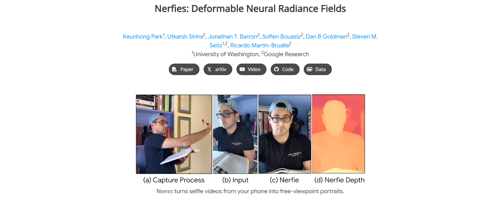
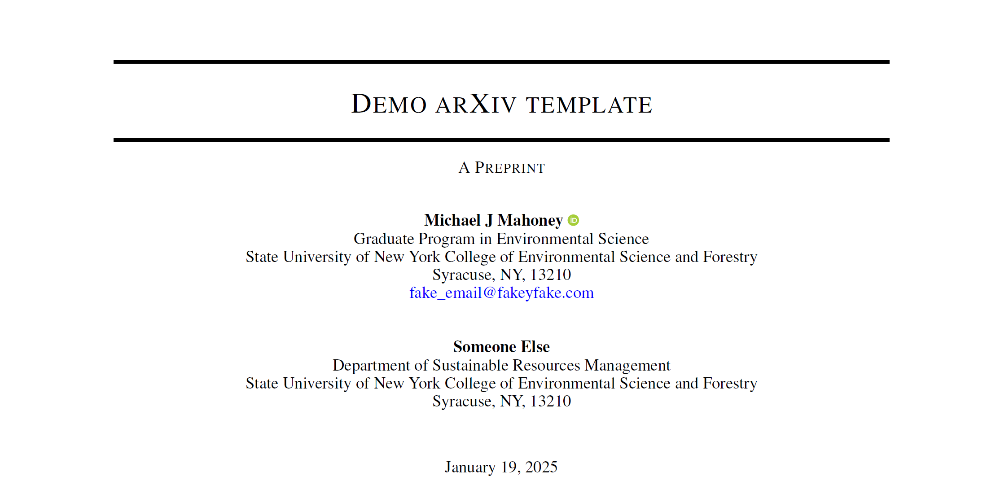

# Academic Project Page and arXiv Article Template




## Features

- Modern Python project structure with Pixi
- Built-in testing with pytest
- Code formatting and linting with Ruff
- Documentation with MkDocs and Quarto
- CLI tool integration with Typer

## Requirements

- Python >= 3.11
- [Pixi](https://prefix.dev/docs/pixi/overview) package manager

## Installation

1. Clone the repository:
```bash
git clone https://github.com/eLearningHub/pixi-template.git
cd pixi-template
```

2. Install dependencies using Pixi (If you are using an Apple Silicon MacBook, please refer to the Note.):
```bash
sudo apt-get install lmodern
curl -fsSL https://pixi.sh/install.sh | bash
pixi install
pixi run install-quarto-extensions
```

### Note:
If you're using a MacBook equipped with Apple M-series chips, you might need to include `osx-arm64` in your list of platforms. To do this, please follow the instructions below instead:

```bash
sudo apt-get install lmodern
curl -fsSL https://pixi.sh/install.sh | bash
pixi project platform add osx-arm64
pixi install
pixi run install-quarto-extensions
```


## Documentation

The project uses Quarto for documentation:

```bash
pixi run docs
```

There is also a shorter form:

```bash
pixi r docs
```

You can then find the project page and the arXiv article in the `docs/_output` folder.

## Development Tasks

The project includes several predefined tasks that can be run using `pixi run`:

- `test`: Run pytest test suite
  ```bash
  pixi run test
  ```

- `lint`: Check code with Ruff
  ```bash
  pixi run lint
  ```

- `format`: Format code with Ruff
  ```bash
  pixi run format
  ```

- `docs`: Build Quarto documentation
  ```bash
  pixi run docs
  ```

- `cli`: Run CLI tool
  ```bash
  pixi run cli
  ```

- `start`: Start the project using the `main.py` under `src` folder:
  ```bash
  pixi run start
  ```

## Testing

Tests are written using pytest. Run the test suite with:

```bash
pixi run test
```

Test configuration is specified in `pyproject.toml` under `[tool.pytest.ini_options]`.

## Code Style

This project uses Ruff for code formatting and linting:

- Line length is set to 100 characters
- Enforces import sorting
- Checks for common bugs and code smells

Format your code with:
```bash
pixi run format
```

Check for issues with:
```bash
pixi run lint
```

## Project Structure
```
pixi-template/
├── src/
│   ├── pixi_project/
│   │    ├── cli.py
│   │    └── sample_python_code.py
│   └── main.py
├── tests/
│   └── test_sample_python_code.py
├── docs/
├── pyproject.toml
├── README.md
└── LICENSE
```

## License

This project is licensed under the MIT License - see the LICENSE file for details.

## Contributing

1. Fork the repository
2. Create a new branch for your feature
3. Make your changes
4. Run tests and linting
5. Submit a pull request

## Acknowledgements

We extend our heartfelt gratitude to the authors of [Nerfies](https://nerfies.github.io/) for generously open-sourcing their website template, which inspired this project’s design and functionality.  

We also sincerely thank [Michael J. Mahoney](https://www.mm218.dev/) for creating and sharing the invaluable [Quarto template for arXiv preprints](https://github.com/mikemahoney218/quarto-arxiv).  

## Contact

[Behzad Samadi](https://www.mechatronics3d.com/)
