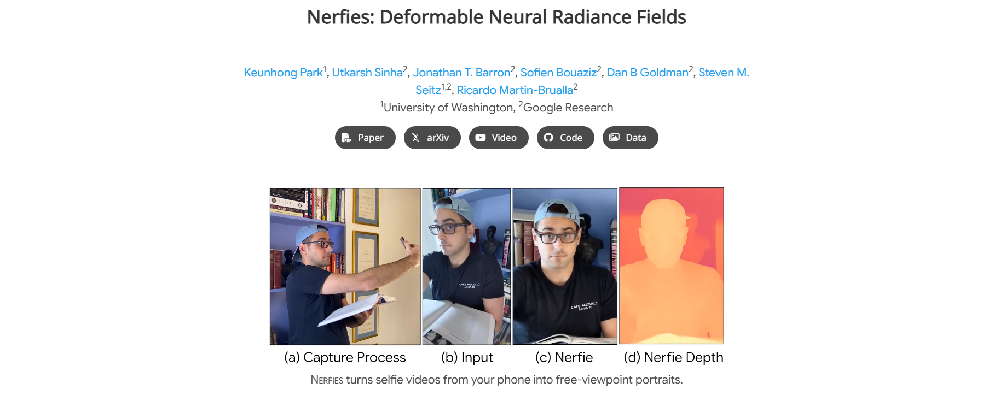

# Pixi Project

[](https://github.com/eLearningHub/academic-project-template/actions/workflows/tests.yml)
[](https://github.com/eLearningHub/academic-project-template/actions/workflows/lint.yml)
<!-- Restore each badge once its service is set up:
     Read the Docs: no project "pixi-project" exists yet; import the repository on readthedocs.org and use its slug.
     PyPI: pixi-project has not been published.
     Codecov: uploads fail without a CODECOV_TOKEN secret.
[](https://pixi-project.readthedocs.io/en/latest/?badge=latest)
[](https://pypi.org/project/pixi-project/)
[](https://codecov.io/gh/eLearningHub/academic-project-template)
-->
[](https://opensource.org/licenses/MIT)

A template for creating Python projects with modern development practices.



## Features

- Packaging and dependency management with Pixi
- Test automation with Nox
- Linting with pre-commit and Ruff
- Continuous integration with GitHub Actions
- Documentation with Sphinx, MyST, and Read the Docs using the furo theme
- Automated uploads to PyPI and TestPyPI
- Automated release notes with Release Drafter
- Automated dependency updates with Dependabot
- Code formatting with Ruff
- Testing with pytest
- Code coverage with Coverage.py
- Coverage reporting with Codecov
- Command-line interface with Typer
- Static type-checking with mypy
- Runtime type-checking with Typeguard
- Automated Python syntax upgrades with pyupgrade
- Security audit with Bandit and pip-audit
- Check documentation examples with xdoctest
- Generate API documentation with autodoc and napoleon
<!-- - Generate command-line reference with sphinx-click (sphinx-click cannot read Typer 0.27, which vendors its own Click) -->
- Manage project labels with GitHub Labeler

## Requirements

- Python >= 3.11
- [Pixi](https://pixi.sh) package manager

## Installation

<!-- Not published to PyPI yet.
### From PyPI

```bash
pip install pixi-project
```
-->

### For Development

1. Clone the repository:
```bash
git clone https://github.com/eLearningHub/academic-project-template.git
cd academic-project-template
```

2. Install Pixi if you haven't already:
```bash
curl -fsSL https://pixi.sh/install.sh | bash
```

3. Install dependencies using Pixi:
```bash
pixi install
```

4. Install development dependencies:
```bash
pixi run install-dev
```

5. Install pre-commit hooks:
```bash
pixi run pre-commit install
```

6. (Optional) Install Quarto extensions if needed:
```bash
pixi run install-quarto-extensions
```

<!-- osx-arm64 is already in tool.pixi.workspace.platforms, so Apple Silicon needs no extra step.
### Note for Apple Silicon Users:
If you're using a MacBook equipped with Apple M-series chips, you might need to include `osx-arm64` in your list of platforms:

```bash
pixi project platform add osx-arm64
pixi install
```
-->

> **Important**: When using Pixi, always add dependencies with `pixi add` commands instead of editing pyproject.toml directly. Use `pixi add [package]` for dependencies (`pixi add --pypi [package]` for packages only on PyPI).<!-- `pixi add --pypi --feature dev [package]` adds to the dev feature, which no pixi environment uses yet. --> Pixi will automatically update the pyproject.toml file with the appropriate configuration. See [pixi_setup.md](pixi_setup.md) for more details.

## Documentation

<!-- Not published yet; see the badge note at the top.
The documentation is available at [pixi-project.readthedocs.io](https://pixi-project.readthedocs.io/).
-->

To build the documentation locally:

### Using Quarto

```bash
pixi run docs
```

### Using Sphinx

```bash
pixi run sdocs
```

The Sphinx documentation will be available in the `docs/_build` directory.

## Development Tasks

The project includes several predefined tasks that can be run using Pixi:

```bash
# Run tests
pixi run test

# Format code
pixi run format

# Lint code
pixi run lint

# Type check
pixi run mypy

# Build documentation
pixi run docs

# Run the CLI
pixi run cli
```

## Using Nox

For additional isolation, you can use Nox:

```bash
# Install Nox
pip install nox

# Run tests
nox -s tests

# Lint and check formatting (ruff)
nox -s lint

# Type check
nox -s mypy

# Build documentation
nox -s docs
```

## Project Structure
```
academic-project-template/
├── src/
│   └── pixi_project/
│       ├── __init__.py
│       └── cli.py
├── tests/
│   ├── __init__.py
│   └── test_cli.py
├── docs/
│   ├── conf.py
│   ├── index.md
│   └── ...
├── .github/
│   └── workflows/
│       ├── tests.yml
│       ├── lint.yml
│       └── release.yml
├── pyproject.toml
├── noxfile.py
├── .pre-commit-config.yaml
├── .readthedocs.yaml
├── CODE_OF_CONDUCT.md
├── CHANGELOG.md
├── pixi_setup.md
└── README.md
```

## License

This project is licensed under the MIT License, as declared in `pyproject.toml`.<!-- No LICENSE file exists yet; add one and restore: see the [LICENSE](LICENSE) file for details. -->

## Contributing

Contributions are welcome! Please see [CONTRIBUTING.md](CONTRIBUTING.md) for details.

## Acknowledgements

We extend our heartfelt gratitude to the authors of [Nerfies](https://nerfies.github.io/) for generously open-sourcing their website template, which inspired this project's design and functionality.

We also sincerely thank [Michael J. Mahoney](https://www.mm218.dev/) for creating and sharing the invaluable [Quarto template for arXiv preprints](https://github.com/mikemahoney218/quarto-arxiv).

## Contact

[Behzad Samadi](https://www.mechatronics3d.com/)
