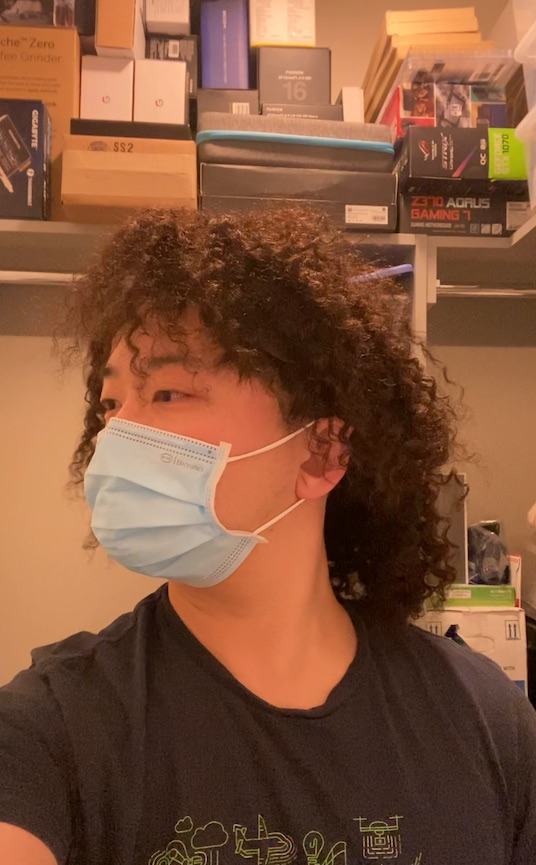
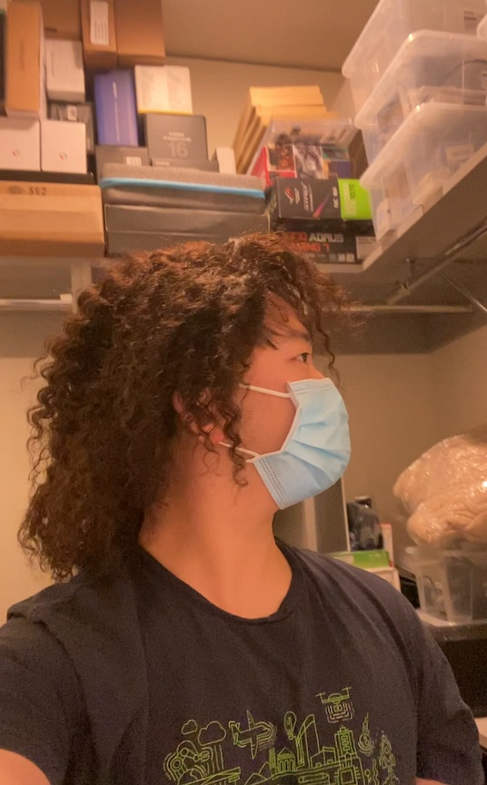

::: {.hero}
::: {.hero-body}
::: {.container .is-max-desktop}
::: {.columns .is-centered}
::: {.column .has-text-centered}
::: {.is-size-5 .publication-authors}
[Keunhong Park](https://keunhong.com)^1^,
[Utkarsh Sinha](https://utkarshsinha.com)^2^,
[Jonathan T. Barron](https://jonbarron.info)^2^,
[Sofien Bouaziz](http://sofienbouaziz.com)^2^,
[Dan B Goldman](https://www.danbgoldman.com)^2^,
[Steven M. Seitz](https://homes.cs.washington.edu/~seitz/)^1,2^,
[Ricardo Martin-Brualla](http://www.ricardomartinbrualla.com)^2^
:::

::: {.is-size-5 .publication-authors}
^1^University of Washington, ^2^Google Research
:::

::: {.column .has-text-centered .is-full}
::: {.publication-links}
<span class="link-block">
  <a href="https://arxiv.org/pdf/2011.12948"
     class="external-link button is-normal is-rounded is-dark">
    <span class="icon">
        <i class="fas fa-file-pdf"></i>
    </span>
    <span>Paper</span>
  </a>
</span>
<span class="link-block">
  <a href="https://arxiv.org/abs/2011.12948"
     class="external-link button is-normal is-rounded is-dark">
    <span class="icon">
        <i class="ai ai-arxiv"></i>
    </span>
    <span>arXiv</span>
  </a>
</span>
<!-- Video Link. -->
<span class="link-block">
  <a href="https://www.youtube.com/watch?v=MrKrnHhk8IA"
     class="external-link button is-normal is-rounded is-dark">
    <span class="icon">
        <i class="fab fa-youtube"></i>
    </span>
    <span>Video</span>
  </a>
</span>
<!-- Code Link. -->
<span class="link-block">
  <a href="https://github.com/google/nerfies"
     class="external-link button is-normal is-rounded is-dark">
    <span class="icon">
        <i class="fab fa-github"></i>
    </span>
    <span>Code</span>
    </a>
</span>
<!-- Dataset Link. -->
<span class="link-block">
  <a href="https://github.com/google/nerfies/releases/tag/0.1"
     class="external-link button is-normal is-rounded is-dark">
    <span class="icon">
        <i class="far fa-images"></i>
    </span>
    <span>Data</span>
    </a>
</span>
:::
:::
:::
:::
:::
:::
:::

::: {.hero .teaser}
::: {.container .is-max-desktop}
::: {.hero-body}
<video id="teaser" autoplay muted loop playsinline height="100%">
    <source src="./videos/teaser.mp4" type="video/mp4"></source>
</video>
::: {.subtitle .has-text-centered}
[Nerfies]{.dnerf} turns selfie videos from your phone into free-viewpoint portraits.
:::
:::
:::
:::

::: {.section .hero .is-light .is-small}
::: {.hero-body}
::: {.container}
::: {#results-carousel .carousel .results-carousel}
::: {.item .item-steve}
<video poster="" id="steve" autoplay controls muted loop playsinline height="100%">
    <source src="./videos/steve.mp4" type="video/mp4"></source>
</video>
:::
::: {.item .item-chair-tp}
<video poster="" id="chair-tp" autoplay controls muted loop playsinline height="100%">
    <source src="./videos/chair-tp.mp4" type="video/mp4"></source>
</video>
:::
::: {.item .item-shiba}
<video poster="" id="shiba" autoplay controls muted loop playsinline height="100%">
    <source src="./videos/shiba.mp4" type="video/mp4"></source>
</video>
:::
::: {.item .item-fullbody}
<video poster="" id="fullbody" autoplay controls muted loop playsinline height="100%">
    <source src="./videos/fullbody.mp4" type="video/mp4"></source>
</video>
:::
::: {.item .item-blueshirt}
<video poster="" id="blueshirt" autoplay controls muted loop playsinline height="100%">
    <source src="./videos/blueshirt.mp4" type="video/mp4"></source>
</video>
:::
::: {.item .item-mask}
<video poster="" id="mask" autoplay controls muted loop playsinline height="100%">
    <source src="./videos/mask.mp4" type="video/mp4"></source>
</video>
:::
::: {.item .item-coffee}
<video poster="" id="coffee" autoplay controls muted loop playsinline height="100%">
    <source src="./videos/coffee.mp4" type="video/mp4"></source>
</video>
:::
::: {.item .item-toby}
<video poster="" id="toby" autoplay controls muted loop playsinline height="100%">
    <source src="./videos/toby2.mp4" type="video/mp4"></source>
</video>
:::
:::
:::
:::
:::

::: {.section}
::: {.container .is-max-desktop}
::: {.columns .is-centered}
::: {.column .is-four-fifths}
## Abstract

::: {.content .has-text-justified}
We present the first method capable of photorealistically reconstructing a non-rigidly deforming scene using photos/videos captured casually from mobile phones.

Our approach augments neural radiance fields (NeRF) by optimizing an additional continuous volumetric deformation field that warps each observed point into a canonical 5D NeRF. We observe that these NeRF-like deformation fields are prone to local minima, and propose a coarse-to-fine optimization method for coordinate-based models that allows for more robust optimization. By adapting principles from geometry processing and physical simulation to NeRF-like models, we propose an elastic regularization of the deformation field that further improves robustness.

We show that [Nerfies]{.dnerf} can turn casually captured selfie photos/videos into deformable NeRF models that allow for photorealistic renderings of the subject from arbitrary viewpoints, which we dub *"nerfies"*. We evaluate our method by collecting data using a rig with two mobile phones that take time-synchronized photos, yielding train/validation images of the same pose at different viewpoints. We show that our method faithfully reconstructs non-rigidly deforming scenes and reproduces unseen views with high fidelity.
:::
:::
:::

::: {.columns .is-centered .has-text-centered}
::: {.column .is-four-fifths}
## Video


:::
:::
:::
:::

::: {.container .is-max-desktop}
::: {.columns}
::: {.column width="50%" .px-4}
## Visual Effects

Using *nerfies* you can create fun visual effects. This Dolly zoom effect would be impossible without nerfies since it would require going through a wall.

<video id="dollyzoom" autoplay controls muted loop playsinline height="100%">
    <source src="./videos/dollyzoom-stacked.mp4" type="video/mp4"></source>
</video>
:::

::: {.column width="50%" .px-4}
## Matting

As a byproduct of our method, we can also solve the matting problem by ignoring samples that fall outside of a bounding box during rendering.

<video id="matting" autoplay controls muted loop playsinline height="100%">
    <source src="./videos/matting.mp4" type="video/mp4"></source>
</video>
:::
:::
:::

## Animation

### Interpolating states

We can also animate the scene by interpolating the deformation latent codes of two input frames. Use the slider here to linearly interpolate between the left frame and the right frame.

::: {.columns .is-vcentered .interpolation-panel}
::: {.column .is-3 .has-text-centered}

:::

::: {.column .interpolation-video-column}
<div id="interpolation-image-wrapper">Loading...</div>
<input class="slider is-fullwidth is-large is-info" id="interpolation-slider" step="1" min="0" max="100" value="0" type="range">
:::

::: {.column .is-3 .has-text-centered}

:::
:::

### Re-rendering the input video

Using Nerfies, you can re-render a video from a novel viewpoint such as a stabilized camera by playing back the training deformations.

<video id="replay" autoplay controls muted loop playsinline height="100%">
    <source src="./videos/replay.mp4" type="video/mp4"></source>
</video>

## Related Links

There's a lot of excellent work that was introduced around the same time as ours.

- [Progressive Encoding for Neural Optimization](https://arxiv.org/abs/2104.09125) introduces an idea similar to our windowed position encoding for coarse-to-fine optimization.

- [D-NeRF](https://www.albertpumarola.com/research/D-NeRF/index.html) and [NR-NeRF](https://gvv.mpi-inf.mpg.de/projects/nonrigid_nerf/) both use deformation fields to model non-rigid scenes.

- Some works model videos with a NeRF by directly modulating the density, such as [Video-NeRF](https://video-nerf.github.io/), [NSFF](https://www.cs.cornell.edu/~zl548/NSFF/), and [DyNeRF](https://neural-3d-video.github.io/)

Check out [Frank Dellart's survey on recent NeRF papers](https://dellaert.github.io/NeRF/) and [Yen-Chen Lin's curated list of NeRF papers](https://github.com/yenchenlin/awesome-NeRF).

## BibTeX

```bibtex
@article{park2021nerfies,
  author    = {Park, Keunhong and Sinha, Utkarsh and Barron, Jonathan T. and Bouaziz, Sofien and Goldman, Dan B and Seitz, Steven M. and Martin-Brualla, Ricardo},
  title     = {Nerfies: Deformable Neural Radiance Fields},
  journal   = {ICCV},
  year      = {2021},
}
```

::: {.footer-license}
This website is licensed under a [Creative Commons Attribution-ShareAlike 4.0 International License](http://creativecommons.org/licenses/by-sa/4.0/).



This means you are free to borrow the [source code](https://github.com/nerfies/nerfies.github.io) of this website, we just ask that you link back to this page in the footer.
:::